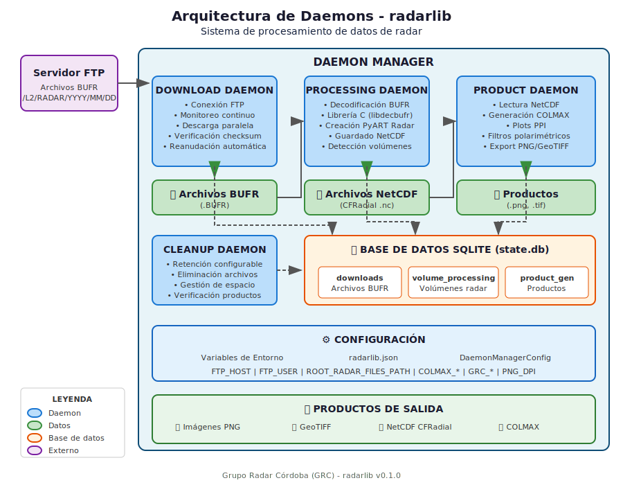
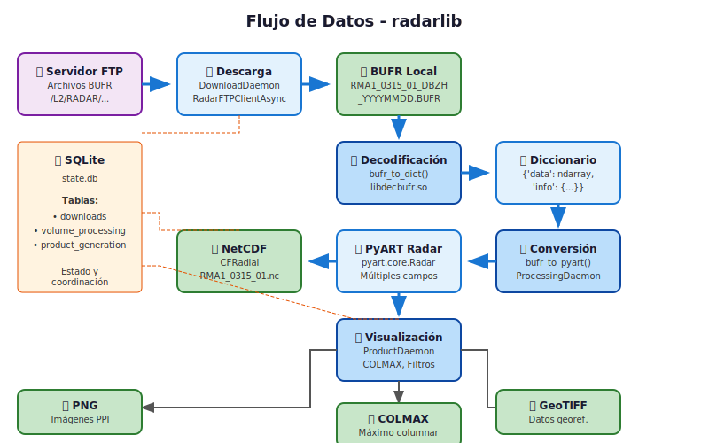

# 4. Arquitectura de Daemons

## Descripción General

radarlib implementa una arquitectura basada en daemons asíncronos independientes que trabajan en conjunto para procesar datos de radar de manera continua y automatizada. Esta arquitectura permite escalabilidad, tolerancia a fallos y operación 24/7.

## Diagramas de Arquitectura

### Diagrama de Arquitectura General



### Diagrama de Flujo de Datos



## Diagrama ASCII de Arquitectura General

```
┌─────────────────────────────────────────────────────────────────────────────┐
│                           ARQUITECTURA RADARLIB                              │
├─────────────────────────────────────────────────────────────────────────────┤
│                                                                              │
│   ┌─────────────┐                                                           │
│   │  Servidor   │                                                           │
│   │    FTP      │                                                           │
│   │   Remoto    │                                                           │
│   └──────┬──────┘                                                           │
│          │                                                                   │
│          │ Archivos BUFR                                                    │
│          ▼                                                                   │
│   ┌──────────────────────────────────────────────────────────────────────┐  │
│   │                     DAEMON MANAGER                                    │  │
│   │  ┌────────────────────────────────────────────────────────────────┐  │  │
│   │  │                                                                 │  │  │
│   │  │  ┌─────────────────┐    ┌─────────────────┐                    │  │  │
│   │  │  │    DOWNLOAD     │    │   PROCESSING    │                    │  │  │
│   │  │  │     DAEMON      │───▶│     DAEMON      │                    │  │  │
│   │  │  │                 │    │                 │                    │  │  │
│   │  │  │ • Conexión FTP  │    │ • Decodificación│                    │  │  │
│   │  │  │ • Monitoreo     │    │   BUFR          │                    │  │  │
│   │  │  │ • Descarga      │    │ • Conversión    │                    │  │  │
│   │  │  │ • Verificación  │    │   PyART         │                    │  │  │
│   │  │  └────────┬────────┘    │ • Guardado      │                    │  │  │
│   │  │           │             │   NetCDF        │                    │  │  │
│   │  │           │             └────────┬────────┘                    │  │  │
│   │  │           ▼                      │                             │  │  │
│   │  │  ┌─────────────────┐             ▼                             │  │  │
│   │  │  │    Archivos     │    ┌─────────────────┐                    │  │  │
│   │  │  │     BUFR        │    │    Archivos     │                    │  │  │
│   │  │  │   (.BUFR)       │    │    NetCDF       │                    │  │  │
│   │  │  └─────────────────┘    │   (.nc)         │                    │  │  │
│   │  │                         └────────┬────────┘                    │  │  │
│   │  │                                  │                             │  │  │
│   │  │                                  ▼                             │  │  │
│   │  │                         ┌─────────────────┐                    │  │  │
│   │  │                         │    PRODUCT      │                    │  │  │
│   │  │                         │     DAEMON      │                    │  │  │
│   │  │                         │                 │                    │  │  │
│   │  │                         │ • Lectura NetCDF│                    │  │  │
│   │  │                         │ • Gen. COLMAX   │                    │  │  │
│   │  │                         │ • Plots PPI     │                    │  │  │
│   │  │                         │ • Export PNG    │                    │  │  │
│   │  │                         │ • Export        │                    │  │  │
│   │  │                         │   GeoTIFF       │                    │  │  │
│   │  │                         └────────┬────────┘                    │  │  │
│   │  │                                  │                             │  │  │
│   │  │                                  ▼                             │  │  │
│   │  │                         ┌─────────────────┐                    │  │  │
│   │  │                         │   Productos     │                    │  │  │
│   │  │                         │  Visuales       │                    │  │  │
│   │  │                         │ (.png, .tif)    │                    │  │  │
│   │  │                         └─────────────────┘                    │  │  │
│   │  │                                                                │  │  │
│   │  │  ┌─────────────────┐                                           │  │  │
│   │  │  │    CLEANUP      │                                           │  │  │
│   │  │  │     DAEMON      │                                           │  │  │
│   │  │  │                 │                                           │  │  │
│   │  │  │ • Eliminación   │                                           │  │  │
│   │  │  │   archivos      │                                           │  │  │
│   │  │  │   antiguos      │                                           │  │  │
│   │  │  │ • Gestión       │                                           │  │  │
│   │  │  │   almacenamiento│                                           │  │  │
│   │  │  └─────────────────┘                                           │  │  │
│   │  │                                                                │  │  │
│   │  └────────────────────────────────────────────────────────────────┘  │  │
│   │                                                                       │  │
│   │  ┌────────────────────────────────────────────────────────────────┐  │  │
│   │  │                    BASE DE DATOS SQLITE                        │  │  │
│   │  │                                                                │  │  │
│   │  │  ┌─────────────┐  ┌─────────────┐  ┌─────────────────────┐    │  │  │
│   │  │  │  downloads  │  │   volumes   │  │ product_generation  │    │  │  │
│   │  │  │   table     │  │    table    │  │       table         │    │  │  │
│   │  │  └─────────────┘  └─────────────┘  └─────────────────────┘    │  │  │
│   │  │                                                                │  │  │
│   │  └────────────────────────────────────────────────────────────────┘  │  │
│   └──────────────────────────────────────────────────────────────────────┘  │
│                                                                              │
└─────────────────────────────────────────────────────────────────────────────┘
```

## Componentes Principales

### 1. Daemon Manager (`DaemonManager`)

El DaemonManager es el controlador central que coordina todos los daemons.

**Responsabilidades:**
- Inicialización y configuración de daemons
- Control de inicio/parada de servicios
- Monitoreo de estado y estadísticas
- Gestión del ciclo de vida

**Configuración:**

```python
from radarlib.daemons import DaemonManager, DaemonManagerConfig
from datetime import datetime, timezone
from pathlib import Path

config = DaemonManagerConfig(
    radar_name="RMA1",                    # Código del radar
    base_path=Path("./radar_data"),       # Directorio base
    ftp_host="ftp.servidor.com",          # Servidor FTP
    ftp_user="usuario",                   # Usuario FTP
    ftp_password="contraseña",            # Contraseña FTP
    ftp_base_path="/L2",                  # Ruta base en FTP
    volume_types=volume_types,            # Tipos de volumen
    start_date=datetime.now(timezone.utc), # Fecha de inicio
    enable_download_daemon=True,          # Habilitar descarga
    enable_processing_daemon=True,        # Habilitar procesamiento
    enable_product_daemon=True,           # Habilitar productos
    enable_cleanup_daemon=False,          # Limpieza deshabilitada
    download_poll_interval=60,            # Intervalo descarga (seg)
    processing_poll_interval=30,          # Intervalo procesamiento
    product_poll_interval=30,             # Intervalo productos
    cleanup_poll_interval=1800,           # Intervalo limpieza
)

manager = DaemonManager(config)
```

### 2. Download Daemon (`DownloadDaemon`)

Monitorea el servidor FTP y descarga nuevos archivos BUFR.

**Flujo de trabajo:**

```
┌──────────────────┐
│  Inicialización  │
└────────┬─────────┘
         │
         ▼
┌──────────────────┐
│ Conexión FTP     │
│ (con retry)      │
└────────┬─────────┘
         │
         ▼
┌──────────────────┐     ┌──────────────────┐
│ Obtener fecha    │────▶│ Consultar último │
│ de reanudación   │     │ archivo en BD    │
└────────┬─────────┘     └──────────────────┘
         │
         ▼
┌──────────────────┐
│ Recorrer         │
│ estructura FTP   │
│ /L2/RADAR/YYYY/  │
│ MM/DD/HH/MMSS/   │
└────────┬─────────┘
         │
         ▼
┌──────────────────┐
│ Filtrar por      │
│ vol_types        │
│ (regex)          │
└────────┬─────────┘
         │
         ▼
┌──────────────────┐
│ Descargar        │
│ archivos nuevos  │
│ (paralelo)       │
└────────┬─────────┘
         │
         ▼
┌──────────────────┐
│ Registrar en BD  │
│ status=completed │
└────────┬─────────┘
         │
         ▼
┌──────────────────┐
│ Esperar          │
│ poll_interval    │
└────────┬─────────┘
         │
         └──────────────────┐
                            │
         ┌──────────────────┘
         │
         ▼
    (repetir ciclo)
```

**Configuración:**

```python
from radarlib.daemons import DownloadDaemon, DownloadDaemonConfig

config = DownloadDaemonConfig(
    host="ftp.servidor.com",
    username="usuario",
    password="contraseña",
    radar_name="RMA1",
    remote_base_path="/L2",
    local_bufr_dir=Path("./bufr"),
    state_db=Path("./state.db"),
    poll_interval=60,
    max_concurrent_downloads=5,
    vol_types={
        "0315": {
            "01": ["DBZH", "DBZV", "ZDR", "RHOHV", "PHIDP", "KDP"],
            "02": ["VRAD", "WRAD"]
        }
    }
)

daemon = DownloadDaemon(config)
```

### 3. Processing Daemon (`ProcessingDaemon`)

Procesa archivos BUFR descargados y genera archivos NetCDF.

**Flujo de trabajo:**

```
┌──────────────────┐
│  Inicialización  │
└────────┬─────────┘
         │
         ▼
┌──────────────────┐
│ Verificar        │
│ volúmenes        │
│ atascados        │
└────────┬─────────┘
         │
         ▼
┌──────────────────┐
│ Verificar        │
│ completitud de   │
│ volúmenes        │
└────────┬─────────┘
         │
         ▼
┌──────────────────────────────────────────────────────────────┐
│ Para cada volumen completo:                                   │
│ ┌──────────────────┐    ┌──────────────────┐                 │
│ │ Obtener archivos │───▶│ Decodificar BUFR │                 │
│ │ BUFR del volumen │    │ (bufr_to_dict)   │                 │
│ └──────────────────┘    └────────┬─────────┘                 │
│                                  │                            │
│                                  ▼                            │
│                         ┌──────────────────┐                 │
│                         │ Crear objeto     │                 │
│                         │ PyART Radar      │                 │
│                         └────────┬─────────┘                 │
│                                  │                            │
│                                  ▼                            │
│                         ┌──────────────────┐                 │
│                         │ Guardar NetCDF   │                 │
│                         │ (CFRadial)       │                 │
│                         └────────┬─────────┘                 │
│                                  │                            │
│                                  ▼                            │
│                         ┌──────────────────┐                 │
│                         │ Actualizar BD    │                 │
│                         │ status=completed │                 │
│                         └──────────────────┘                 │
└──────────────────────────────────────────────────────────────┘
         │
         ▼
┌──────────────────┐
│ Esperar          │
│ poll_interval    │
└────────┬─────────┘
         │
         └────────────────────┐
                              │
         ┌────────────────────┘
         │
         ▼
    (repetir ciclo)
```

**Configuración:**

```python
from radarlib.daemons import ProcessingDaemon, ProcessingDaemonConfig

config = ProcessingDaemonConfig(
    local_bufr_dir=Path("./bufr"),
    local_netcdf_dir=Path("./netcdf"),
    state_db=Path("./state.db"),
    volume_types=volume_types,
    radar_name="RMA1",
    poll_interval=30,
    max_concurrent_processing=2,
    allow_incomplete=False,
    stuck_volume_timeout_minutes=60,
)

daemon = ProcessingDaemon(config)
```

### 4. Product Daemon (`ProductGenerationDaemon`)

Genera productos visuales a partir de archivos NetCDF.

**Flujo de trabajo:**

```
┌──────────────────┐
│  Inicialización  │
└────────┬─────────┘
         │
         ▼
┌──────────────────┐
│ Verificar        │
│ productos        │
│ atascados        │
└────────┬─────────┘
         │
         ▼
┌──────────────────┐
│ Obtener          │
│ volúmenes        │
│ procesados       │
└────────┬─────────┘
         │
         ▼
┌──────────────────────────────────────────────────────────────┐
│ Para cada volumen procesado:                                  │
│ ┌──────────────────┐    ┌──────────────────┐                 │
│ │ Leer archivo     │───▶│ Estandarizar     │                 │
│ │ NetCDF           │    │ campos           │                 │
│ └──────────────────┘    └────────┬─────────┘                 │
│                                  │                            │
│                                  ▼                            │
│                         ┌──────────────────┐                 │
│                         │ Generar COLMAX   │                 │
│                         │ (opcional)       │                 │
│                         └────────┬─────────┘                 │
│                                  │                            │
│                                  ▼                            │
│                    ┌─────────────┴─────────────┐             │
│                    │                           │              │
│                    ▼                           ▼              │
│           ┌──────────────┐            ┌──────────────┐       │
│           │ Plots sin    │            │ Plots con    │       │
│           │ filtros      │            │ filtros      │       │
│           └──────┬───────┘            └──────┬───────┘       │
│                  │                           │               │
│                  └───────────┬───────────────┘               │
│                              │                               │
│                              ▼                               │
│                    ┌──────────────────┐                      │
│                    │ Guardar PNG      │                      │
│                    │ (por campo/sweep)│                      │
│                    └────────┬─────────┘                      │
│                              │                               │
│                              ▼                               │
│                    ┌──────────────────┐                      │
│                    │ Actualizar BD    │                      │
│                    └──────────────────┘                      │
└──────────────────────────────────────────────────────────────┘
         │
         ▼
    (repetir ciclo)
```

**Configuración:**

```python
from radarlib.daemons import ProductGenerationDaemon, ProductGenerationDaemonConfig

config = ProductGenerationDaemonConfig(
    local_netcdf_dir=Path("./netcdf"),
    local_product_dir=Path("./products"),
    state_db=Path("./state.db"),
    volume_types=volume_types,
    radar_name="RMA1",
    poll_interval=30,
    product_type="image",        # 'image' o 'geotiff'
    add_colmax=True,
    stuck_volume_timeout_minutes=60,
)

daemon = ProductGenerationDaemon(config)
```

### 5. Cleanup Daemon (`CleanupDaemon`)

Gestiona el ciclo de vida de archivos eliminando datos antiguos.

**Configuración:**

```python
from radarlib.daemons import CleanupDaemon, CleanupDaemonConfig

config = CleanupDaemonConfig(
    state_db=Path("./state.db"),
    radar_name="RMA1",
    poll_interval=1800,          # Cada 30 minutos
    bufr_retention_days=7,       # Mantener BUFR 7 días
    netcdf_retention_days=7,     # Mantener NetCDF 7 días
    product_types=["image"],     # Tipos de producto requeridos
)

daemon = CleanupDaemon(config)
```

## Base de Datos SQLite

Los daemons comparten una base de datos SQLite para coordinación:

### Tabla `downloads`

```sql
CREATE TABLE downloads (
    id INTEGER PRIMARY KEY,
    filename TEXT UNIQUE,
    remote_path TEXT,
    local_path TEXT,
    status TEXT,          -- 'pending', 'downloading', 'completed', 'failed'
    radar_name TEXT,
    strategy TEXT,
    vol_nr TEXT,
    field_type TEXT,
    observation_datetime TEXT,
    file_size INTEGER,
    checksum TEXT,
    created_at TEXT,
    updated_at TEXT
);
```

### Tabla `volume_processing`

```sql
CREATE TABLE volume_processing (
    volume_id TEXT PRIMARY KEY,
    radar_name TEXT,
    strategy TEXT,
    vol_nr TEXT,
    observation_datetime TEXT,
    expected_fields TEXT,     -- JSON array
    downloaded_fields TEXT,   -- JSON array
    is_complete INTEGER,
    status TEXT,              -- 'pending', 'processing', 'completed', 'failed'
    netcdf_path TEXT,
    error_message TEXT,
    created_at TEXT,
    updated_at TEXT
);
```

### Tabla `product_generation`

```sql
CREATE TABLE product_generation (
    id INTEGER PRIMARY KEY,
    volume_id TEXT,
    product_type TEXT,
    status TEXT,              -- 'pending', 'processing', 'completed', 'failed'
    error_message TEXT,
    error_type TEXT,
    created_at TEXT,
    updated_at TEXT
);
```

## Uso del Daemon Manager

### Ejemplo Completo

```python
import asyncio
import logging
from datetime import datetime, timezone
from pathlib import Path

from radarlib.daemons import DaemonManager, DaemonManagerConfig

# Configurar logging
logging.basicConfig(
    level=logging.INFO,
    format='%(asctime)s - %(name)s - %(levelname)s - %(message)s'
)

# Definir tipos de volumen
volume_types = {
    "0315": {
        "01": ["DBZH", "DBZV", "ZDR", "RHOHV", "PHIDP", "KDP"],
        "02": ["VRAD", "WRAD"]
    },
    "0200": {
        "01": ["DBZH", "DBZV", "ZDR", "RHOHV", "PHIDP", "KDP", "CM"]
    }
}

# Crear configuración
config = DaemonManagerConfig(
    radar_name="RMA1",
    base_path=Path("./radar_data/RMA1"),
    ftp_host="ftp.smn.gob.ar",
    ftp_user="usuario",
    ftp_password="contraseña",
    ftp_base_path="/L2",
    volume_types=volume_types,
    start_date=datetime(2025, 1, 1, tzinfo=timezone.utc),
    enable_download_daemon=True,
    enable_processing_daemon=True,
    enable_product_daemon=True,
    enable_cleanup_daemon=True,
    download_poll_interval=60,
    processing_poll_interval=30,
    product_poll_interval=30,
    cleanup_poll_interval=1800,
    bufr_retention_days=7,
    netcdf_retention_days=14,
)

async def main():
    manager = DaemonManager(config)

    try:
        print("Iniciando todos los daemons...")
        await manager.start()
    except KeyboardInterrupt:
        print("\nDeteniendo daemons...")
        manager.stop()

    # Mostrar estadísticas finales
    status = manager.get_status()
    print(f"\nEstadísticas finales:")
    print(f"  Archivos descargados: {status['download_daemon']['stats']}")
    print(f"  Volúmenes procesados: {status['processing_daemon']['stats']}")
    print(f"  Productos generados: {status['product_daemon']['stats']}")

if __name__ == "__main__":
    asyncio.run(main())
```

### Control Individual de Daemons

```python
# Detener solo el daemon de descarga
manager.download_daemon.stop()

# Reiniciar con nueva configuración
await manager.restart_download_daemon({
    'poll_interval': 30  # Más frecuente
})

# Obtener estado
status = manager.get_status()
print(f"Download running: {status['download_daemon']['running']}")
print(f"Processing running: {status['processing_daemon']['running']}")
```

---

*Continúe con el capítulo [Módulos Principales](./05_modulos_principales.md) para conocer las funciones específicas.*
